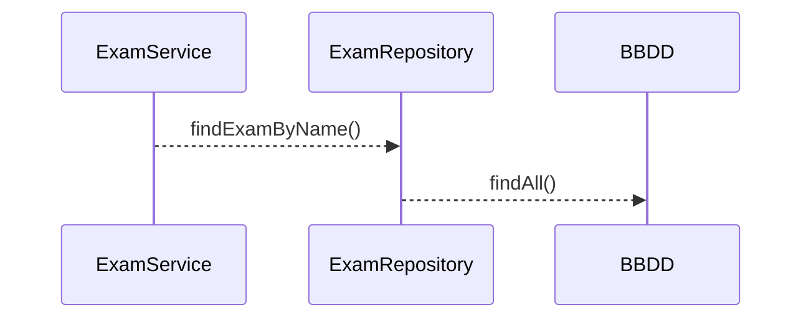

# Kata Junit - Mockito - JaCoCo  sobre Spring Boot
Este repositorio está diseñado para aplicar de manera práctica conceptos de Junit y Mockito mediante un código simple comprendido por un POJO - Service y Repository sobre framework de Spring Boot.
En este documento se describe el paso a paso de la Kata y su aplicación.

## Creación y configuración de proyecto (Kata 1)

### Configuración de dependencias y plugins en el pom

Crear proyecto de tipo Spring Boot con Maven en el IDE de preferencia o utilizado en la organización.
Explicar la configuración de dependencias al modificando el **pom.xml** agregando las dependencias y plugins de:

> **pom.xml  :** 

*Junit*

    <dependency>
        <groupId>org.junit.jupiter</groupId>
        <artifactId>junit-jupiter</artifactId>
        <version>5.X.X</version>
    </dependency>

*Mockito*

    <dependency>
        <groupId>org.mockito</groupId>
        <artifactId>mockito-core</artifactId>
        <version>X.X.X</version>
    </dependency>
    <dependency>
        <groupId>org.mockito</groupId>
        <artifactId>mockito-junit-jupiter</artifactId>
        <version>X.X.X</version>
    </dependency>
*JaCoCo*

    <plugin>
        <groupId>org.jacoco</groupId>
        <artifactId>jacoco-maven-plugin</artifactId>
        <version>x.x.x</version>
        <executions>
    	    <execution>
    		    <goals>
    			    <goal>prepare-agent</goal>
    		    </goals>
    	    </execution>
	        <execution>
	    	    <id>report</id>
	    	    <phase>prepare-package</phase>
	    	    <goals>
	    		    <goal>report</goal>
	    	    </goals>
	    	    <configuration>
			       <dataFile>${project.basedir}/target/jacoco.exec</dataFile>
					<outputDirectory>${project.basedir}/target/jacoco</outputDirectory>
		        </configuration>
	        </execution>
	      </executions>
	  </plugin>
### Componentes del proyecto

### Implementaciones iniciales
> **ExamServiceImpl.java  :** 

    public  class  ExamServiceImpl  implements  ExamService {
	    ExamRepository  examRepository;
	    public  ExamServiceImpl(ExamRepository  examRepository) {
		    this.examRepository = examRepository;
	    }
	    @Override
	    public  Exam  findExamByName(String  name) {
		    Optional<Exam> examOptional = examRepository.findAll()
			    .stream()
			    .filter(e  ->  e.getName().contains(name))
			    .findFirst();
		    Exam  exam = null;
		    if(examOptional.isPresent()){
		    exam = examOptional.orElseThrow(null);
		    }
		    return  exam;
	    }
    }

> **ExamRepositoryImpl.java  :** 

    package  com.example.microproyectos.mockitoapp.repositories;
    import  java.util.Collections;
    import  java.util.List;
    import  com.example.microproyectos.mockitoapp.models.Exam;

    public  class  ExamRepositoryImpl  implements  ExamRepository{
	    @Override
	    public  List<Exam> findAll() {
		    return  Collections.emptyList();
	    }
    }
