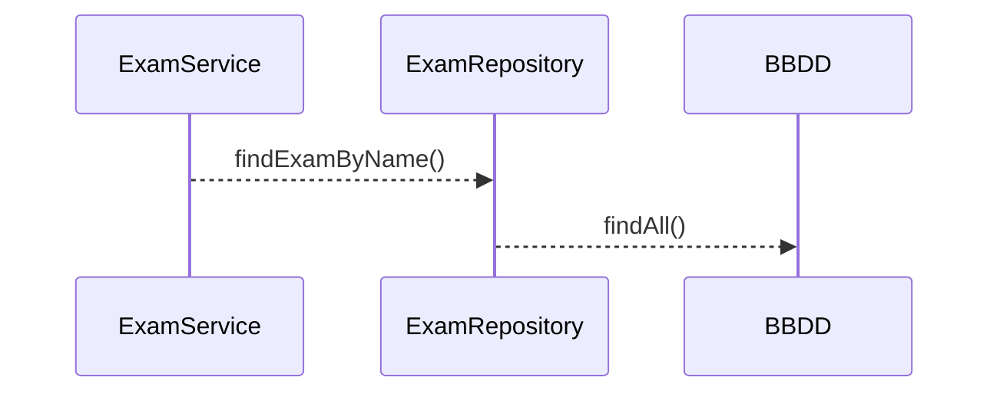

# Kata Junit - Mockito - JaCoCo  sobre Spring Boot
Este repositorio está diseñado para aplicar de manera práctica conceptos de Junit y Mockito mediante un código simple comprendido por un POJO - Service y Repository sobre framework de Spring Boot.
En este documento se describe el paso a paso de la Kata y su aplicación.

## Creación y configuración de proyecto (Kata 1)

### Configuración de dependencias y plugins en el pom

Crear proyecto de tipo Spring Boot con Maven en el IDE de preferencia o utilizado en la organización.
Explicar la configuración de dependencias al modificando el **pom.xml** agregando las dependencias y plugins de:

> **pom.xml  :** 

*Junit*
```xml
    <dependency>
        <groupId>org.junit.jupiter</groupId>
        <artifactId>junit-jupiter</artifactId>
        <version>5.X.X</version>
    </dependency>
```
*Mockito*
```xml
    <dependency>
        <groupId>org.mockito</groupId>
        <artifactId>mockito-core</artifactId>
        <version>X.X.X</version>
    </dependency>
    <dependency>
        <groupId>org.mockito</groupId>
        <artifactId>mockito-junit-jupiter</artifactId>
        <version>X.X.X</version>
    </dependency>
```
*JaCoCo*
```xml
    <plugin>
        <groupId>org.jacoco</groupId>
        <artifactId>jacoco-maven-plugin</artifactId>
        <version>x.x.x</version>
        <executions>
    	    <execution>
    		    <goals>
    			    <goal>prepare-agent</goal>
    		    </goals>
    	    </execution>
	        <execution>
	    	    <id>report</id>
	    	    <phase>prepare-package</phase>
	    	    <goals>
	    		    <goal>report</goal>
	    	    </goals>
	    	    <configuration>
			       <dataFile>${project.basedir}/target/jacoco.exec</dataFile>
					<outputDirectory>${project.basedir}/target/jacoco</outputDirectory>
		        </configuration>
	        </execution>
	      </executions>
	  </plugin>
```
### Componentes del proyecto

### Implementaciones iniciales
> **ExamServiceImpl.java  :** 
```java
    public  class  ExamServiceImpl  implements  ExamService {
	    ExamRepository  examRepository;
	    public  ExamServiceImpl(ExamRepository  examRepository) {
		    this.examRepository = examRepository;
	    }
	    @Override
	    public  Exam  findExamByName(String  name) {
		    Optional<Exam> examOptional = examRepository.findAll()
			    .stream()
			    .filter(e  ->  e.getName().contains(name))
			    .findFirst();
		    Exam  exam = null;
		    if(examOptional.isPresent()){
		    exam = examOptional.orElseThrow(null);
		    }
		    return  exam;
	    }
    }
```
> **ExamRepositoryImpl.java  :** 
```java
    package  com.example.microproyectos.mockitoapp.repositories;
    import  java.util.Collections;
    import  java.util.List;
    import  com.example.microproyectos.mockitoapp.models.Exam;

    public  class  ExamRepositoryImpl  implements  ExamRepository{
	    @Override
	    public  List<Exam> findAll() {
		    return  Collections.emptyList();
	    }
    }
```
## Crear un test utilizando la implementación del repositorio (Kata 2)
Crear un test que permita comprobar el funcionamiento de findExamByName()  utilizando la implementación de ExamRepositoryImpl.java
>test: 
```java
@Test
@DisplayName("should test method service using repository Implement")
void  testKata2_a() {
	ExamRepository  examRepository = new  ExamRepositoryImpl();
	ExamService  examService = new  ExamServiceImpl(examRepository);
	Exam  exam = examService.findExamByName("Matemáticas");
	assertNotNull(exam);
	assertEquals(1L, exam.getId());
}
```
## Modificar el test creado utilizando Mockito (Kata 3)
Modifica el test que permita comprobar el funcionamiento de findExamByName()  para que no dependa de  la implementación de ExamRepositoryImpl.java
> test: 
```java
@Test
@DisplayName("should test method service using Mocks")
void  testKata3() {
	ExamRepository  examRepository = mock(ExamRepository.class);
	ExamService  examService = new  ExamServiceImpl(examRepository);
	List<Exam> exams = Arrays.asList(new  Exam(1L, "Matemáticas"),new  Exam(3L, "Lenguaje"),new  Exam(7L, "Música"));
	when(examRepository.findAll()).thenReturn(exams);
	Exam  exam = examService.findExamByName("Matemáticas");
	assertNotNull(exam);
	assertEquals(1L, exam.getId());
}
```
## Refactorizar implementación de ExamService (Kata 4)
+ Devolvemos en el servicio un Optional< Exam > 
+ Modificamos el test para que verifique  comportamiento
+ Agregamos una nueva prueba que verifique el caso de no encontrar el examen

 > **ExamService.java  :** 
```java 
public  interface  ExamService {
	Optional<Exam> findExamByName(String  name);
}
```
 > **ExamServiceImpl.java  :** 
```java 
@Override
public  Optional<Exam> findExamByName(String  name) {
	return  examRepository.findAll()
				.stream()
				.filter(e  ->  e.getName().contains(name))
				.findFirst();
}
```

tests
>should obtain Math exam when search by name
```java 
@Test
@DisplayName("should obtain Math exam when search by name")
void  testKata4_a() {
	ExamRepository  examRepository = mock(ExamRepository.class);
	ExamService  examService = new  ExamServiceImpl(examRepository);
	List<Exam> exams = Arrays.asList(new  Exam(1L, "Matemáticas"), new  Exam(3L, "Lenguaje"), new  Exam(7L, "Música"));
	when(examRepository.findAll()).thenReturn(exams);
	Optional<Exam> examOptional = examService.findExamByName("Matemáticas");
	assertTrue(examOptional.isPresent());
	assertEquals(1L, examOptional.get().getId());
	assertEquals("Matemáticas", examOptional.get().getName());
}
```
>should don't obtain exam when search by name not in list
```java 
@Test
@DisplayName("should don't obtain exam when search by name not in list")
void  testKata4_b() {
ExamRepository  examRepository = mock(ExamRepository.class);
ExamService  examService = new  ExamServiceImpl(examRepository);
List<Exam> exams = Arrays.asList(new  Exam(1L, "Matemáticas"), new  Exam(3L, "Lenguaje"), new  Exam(7L, "Música"));
when(examRepository.findAll()).thenReturn(exams);
Optional<Exam> examOptional = examService.findExamByName("Deportes");
assertFalse(examOptional.isPresent());
}
```
## Ciclo  de vida del test (Kata 5)
+ Refactorizar la clase test para que el repositorio y el servicio se instancien en un @BeforeEach y dejar el código más limpio
+ Generar un nuevo test para verificar el comportamiento cuando se recibe una respuesta vacía desde el repositorio

>refactorización 
````java
ExamRepository  examRepository;
ExamService  examService;
@BeforeEach
void  setUp() {
	examRepository = mock(ExamRepository.class);
	examService = new  ExamServiceImpl(examRepository);
}
@Test
@DisplayName("should obtain Math exam when search by name")
void  testKata4_a() {
	List<Exam> exams = Arrays.asList(new  Exam(1L, "Matemáticas"), new  Exam(3L, "Lenguaje"), new  Exam(7L, "Música"));
	when(examRepository.findAll()).thenReturn(exams);
	Optional<Exam> examOptional = examService.findExamByName("Matemáticas");
	assertTrue(examOptional.isPresent());
	assertEquals(1L, examOptional.get().getId());
	assertEquals("Matemáticas", examOptional.get().getName());
}
@Test
@DisplayName("should don't obtain exam when search by name not in list")
void  testKata4_b() {
	List<Exam> exams = Arrays.asList(new  Exam(1L, "Matemáticas"), new  Exam(3L, "Lenguaje"), new  Exam(7L, "Música"));
	when(examRepository.findAll()).thenReturn(exams);
	Optional<Exam> examOptional = examService.findExamByName("Deportes");
	assertFalse(examOptional.isPresent());
}
````
 >should don't obtain exam when the list is empty
```java
@Test
@DisplayName("should don't obtain exam when the list is empty")
void  testKata5() {
	when(examRepository.findAll()).thenReturn(Collections.emptyList());
	Optional<Exam> examOptional = examService.findExamByName("Deportes");
	assertFalse(examOptional.isPresent());
}
`````
## Implementar un nuevo repositorio para obtener preguntas (Kata 6)
Se requiere obtener desde otro origen de datos las preguntas de los exámenes
 + Agregar la interfaz *QuestionRepository*
 + Implementar un método en *ExamService.java* que busque las respuestas por examen
 + Generar un test que  verifique la obtención de preguntas 
 + Generar un test que verifique el comportamiento cuando el examen no tiene preguntas

> QuestionRepository.java
```java
import  java.util.List;
	public  interface  QuestionRepository {
	List<String> findQuestionsbyId(Long  id);
}
````
> ExamService.java
```java
...
	Exam  FindExamWithQuestionsByName(String  name);
...
````

> ExamServiceImpl.java
```java
public  class  ExamServiceImpl  implements  ExamService {
..
QuestionRepository  questionRepository;

public  ExamServiceImpl(ExamRepository  examRepository, QuestionRepository  questionRepository) {
	this.examRepository = examRepository;
	this.questionRepository = questionRepository;
}
...
@Override
public  Exam  FindExamWithQuestionsByName(String  name) {
	Optional<Exam> examOptional = findExamByName(name);
	Exam  exam = null;
	if (examOptional.isPresent()) {
		exam = examOptional.get();
		List<String> questions = questionRepository.findQuestionsbyId(exam.getId());
		exam.setQuestions(questions);
	}
	return  exam;
}
}
````

tests
>setUp
```java
ExamRepository  examRepository;
QuestionRepository  questionRepository;
ExamService  examService;
@BeforeEach
void  setUp() {
	examRepository = mock(ExamRepository.class);
	questionRepository = mock(QuestionRepository.class);
	examService = new  ExamServiceImpl(examRepository, questionRepository);
}
````

> should obtain exam plus questions by exam name
```java
@Test
@DisplayName("should obtain exam plus questions by exam name")
void  testKata6_a() {
	List<Exam> exams = Arrays.asList(new  Exam(1L, "Matemáticas"), new  Exam(3L, "Lenguaje"), new  Exam(7L, "Música"));
	when(examRepository.findAll()).thenReturn(exams);
	List<String> questions = Arrays.asList("prugunta 1", "2 + 2 =", "integral derivada....");
	when(questionRepository.findQuestionsbyId(1L)).thenReturn(questions);
	Exam  exam = examService.FindExamWithQuestionsByName("Matemáticas");
	assertNotNull(exam);
	assertEquals("Matemáticas", exam.getName());
	assertEquals(3, exam.getQuestions().size());
	assertFalse(exam.getQuestions().isEmpty());
	assertTrue(exam.getQuestions().contains("2 + 2 ="));
}
````

> should obtain exam but dont have questions by exam name
```java
@Test
@DisplayName("should obtain exam but dont have questions by exam name")
void  testKata6_b() {
	List<Exam> exams = Arrays.asList(new  Exam(1L, "Matemáticas"), new  Exam(3L, "Lenguaje"), new  Exam(7L, "Música"));
	when(examRepository.findAll()).thenReturn(exams);
	List<String> questions = Collections.emptyList();
	when(questionRepository.findQuestionsbyId(1L)).thenReturn(questions);
	Exam  exam = examService.FindExamWithQuestionsByName("Matemáticas");
	assertNotNull(exam);
	assertEquals("Matemáticas", exam.getName());
	assertEquals(0, exam.getQuestions().size());
	assertTrue(exam.getQuestions().isEmpty());
}
````
## Refactorizar tests utilizando Datos de prueba estáticos (Kata 7)
+ Crear una clase que mantenga las constantes de los datos de prueba
+ Refactorizar los test para que tomen la data estática
+ Crear test que valide la obtención de un examen con preguntas cuando la lista de exámenes este vacía

>Data.java
```java
package  com.example.microproyectos.mockitoapp.data;
import  java.util.Arrays;
import  java.util.List;
import  com.example.microproyectos.mockitoapp.models.Exam;
public  class  Data {
	public  final  static  List<Exam> EXAMS = Arrays.asList(new  Exam(1L, "Matemáticas"), new  Exam(3L, "Lenguaje"), new  Exam(7L, "Música"));
	public  final  static  List<String> QUESTIONS = Arrays.asList("prugunta 1", "2 + 2 =", "integral derivada....");
}
`````
>Refactorización
```java
@Test
@DisplayName("should obtain Math exam when search by name")
void  testKata4_a() {
	when(examRepository.findAll()).thenReturn(Data.EXAMS);
	Optional<Exam> examOptional = examService.findExamByName("Matemáticas");
	assertTrue(examOptional.isPresent());
	assertEquals(1L, examOptional.get().getId());
	assertEquals("Matemáticas", examOptional.get().getName());
}
@Test
@DisplayName("should don't obtain exam when search by name not in list")
void  testKata4_b() {
	when(examRepository.findAll()).thenReturn(Data.EXAMS);
	Optional<Exam> examOptional = examService.findExamByName("Deportes");
	assertFalse(examOptional.isPresent());
}
@Test
@DisplayName("should don't obtain exam when the list is empty")
void  testKata5() {
	when(examRepository.findAll()).thenReturn(Collections.emptyList());
	Optional<Exam> examOptional = examService.findExamByName("Deportes");
	assertFalse(examOptional.isPresent());
}
@Test
@DisplayName("should obtain exam plus questions by exam name")
void  testKata6_a() {
	when(examRepository.findAll()).thenReturn(Data.EXAMS);
	when(questionRepository.findQuestionsbyId(1L)).thenReturn(Data.QUESTIONS);
	Exam  exam = examService.FindExamWithQuestionsByName("Matemáticas");
	assertNotNull(exam);
	assertEquals("Matemáticas", exam.getName());
	assertEquals(3, exam.getQuestions().size());
	assertFalse(exam.getQuestions().isEmpty());
	assertTrue(exam.getQuestions().contains("2 + 2 ="));
}
@Test
@DisplayName("should obtain exam but dont have questions by exam name")
void  testKata6_b() {
	when(examRepository.findAll()).thenReturn(Data.EXAMS);
	List<String> questions = Collections.emptyList();
	when(questionRepository.findQuestionsbyId(anyLong())).thenReturn(questions);
	Exam  exam = examService.FindExamWithQuestionsByName("Matemáticas");
	assertNotNull(exam);
	assertEquals("Matemáticas", exam.getName());
	assertEquals(0, exam.getQuestions().size());
	assertTrue(exam.getQuestions().isEmpty());
}
`````
>should obtain exam but dont have a list of exams
```java
@Test
@DisplayName("should obtain exam but dont have a list of exams")
void  testKata7() {
	when(examRepository.findAll()).thenReturn(Collections.emptyList());
	Exam  exam = examService.FindExamWithQuestionsByName("Matemáticas");
	assertNull(exam);
}
`````
## Verificar invocaciones de métodos simulados (Kata 8)
Mockito permite verificar las invocaciones de los métodos de las clases  monitoreadas
+ Generar un test que permita verificar el llamado del método simulado de *questionRepository.java*
+ Generar un test que permita verificar que no se llame el método simulado de *questionRepository.java*
>should obtain exam by exam name verifing method call
```java
@Test

@DisplayName("should obtain exam by exam name verifing method call")

void  testKata8_a() {
	when(examRepository.findAll()).thenReturn(Data.EXAMS);
	when(questionRepository.findQuestionsbyId(1L)).thenReturn(Data.QUESTIONS);
	Exam  exam = examService.FindExamWithQuestionsByName("Matemáticas");
	assertNotNull(exam);
	assertEquals("Matemáticas", exam.getName());
	assertEquals(3, exam.getQuestions().size());
	assertFalse(exam.getQuestions().isEmpty());
	assertTrue(exam.getQuestions().contains("2 + 2 ="));
	verify(examRepository).findAll();
	verify(questionRepository).findQuestionsbyId(1L);
}
`````
>should obtain exam but dont have questions by exam name verifing method call
```java
@Test

@DisplayName("should obtain exam but dont have questions by exam name verifing method call")

void  testKata8_b() {
	when(examRepository.findAll()).thenReturn(Data.EXAMS);
	when(questionRepository.findQuestionsbyId(anyLong())).thenReturn(Data.QUESTIONS);
	Exam  exam = examService.FindExamWithQuestionsByName("deportes");
	assertNull(exam);
	verify(examRepository, atLeastOnce()).findAll();
	verify(questionRepository, never()).findQuestionsbyId(anyLong());
}
`````
## Integrar uso de anotaciones  (Kata 9)
+ Definir mocks mediante notación @Mock
+ Integrar dependencia con @injectMocks al la clase concreta
+ Habilitar test mediante MockitoAnnotations.openMocks
+ Usar ExtendsWith como alternativa a MockitoAnnotations
>Definicion de Mocks
```java
@Mock
ExamRepository  examRepository;
@Mock
QuestionRepository  questionRepository;
ExamService  examService;
@BeforeEach
void  setUp() {
/*
	* examRepository = mock(ExamRepository.class);
	* questionRepository = mock(QuestionRepository.class);
	* examService = new ExamServiceImpl(examRepository, questionRepository);
*/ }
`````
>Uso de InjectsMocks
```java
@Mock
ExamRepository  examRepository;
@Mock
QuestionRepository  questionRepository;
@InjectMocks
ExamServiceImpl  examService;
@BeforeEach
void  setUp() {
	/*
	* examRepository = mock(ExamRepository.class);
	* questionRepository = mock(QuestionRepository.class);
	* examService = new ExamServiceImpl(examRepository, questionRepository);
	*/ 
}
`````

>Habilitación
```java
@Mock
ExamRepository  examRepository;
@Mock
QuestionRepository  questionRepository;
@InjectMocks
ExamServiceImpl  examService;
@BeforeEach
void  setUp() {
	MockitoAnnotations.openMocks(this);
}
`````

>Extencion de clases simuladas sin pasar por setup
```java
@ExtendWith(MockitoExtension.class)
public  class  ExamServiceImplTest {
	@Mock
	ExamRepository  examRepository;
	@Mock
	QuestionRepository  questionRepository;
	@InjectMocks
	ExamServiceImpl  examService;
	@BeforeEach
	void  setUp() {}
`````
>Refactorización de test 
```java
@Test
@DisplayName("should obtain exam but dont have questions by exam name verifing method call")
void  testKata8_b() {
	when(examRepository.findAll()).thenReturn(Data.EXAMS);
	Exam  exam = examService.FindExamWithQuestionsByName("deportes");
	assertNull(exam);
	verify(examRepository, atLeastOnce()).findAll();
	verify(questionRepository, never()).findQuestionsbyId(anyLong());
}
`````
## Guardar exámenes con preguntas  (Kata 10)
Permitir guardar exámenes y sus preguntas
+ Implementar los métodos necesarios para guardar la información tanto de exámenes y preguntas 
+ Crear nuevo test que pruebe el comportamiento del nuevo método  y lo verifique

Implementación de nuevo código
> QuestionRepository.java
````java
void  save(List<String> questions);
````
> ExamRepository.java
````java
Exam  save(Exam  exam);
````
> ExamService.java
````java
Exam  saveExam(Exam  exam);
````
> ExamServiceImpl.java
````java
@Override
public  Exam  saveExam(Exam  exam) {
//preguntamos si el examen tiene preguntas
if(!exam.getQuestions().isEmpty()){
	questionRepository.save(exam.getQuestions());
}
return  examRepository.save(exam);
````
Creación de test
> Data.java
```java
public  final  static  Exam  EXAM_TO_SAVE = new  Exam(1L, "Matemáticas");
```````
> should save a exam with question and verify save exam method
````java
@Test
@DisplayName("should save a exam with question and verify save exam method ")
void  testKata10() {
Exam  newExam = Data.EXAM_TO_SAVE;
newExam.setQuestions(Data.QUESTIONS);
when(examRepository.save(any(Exam.class))).thenReturn(Data.EXAM_TO_SAVE);
Exam  exam = examService.saveExam(Data.EXAM_TO_SAVE);
assertNotNull(exam);
assertEquals(1L, exam.getId());
assertEquals("Matemáticas", exam.getName());
verify(examRepository).save(any(Exam.class));
verify(questionRepository).save(anyList());
}
`````
## Simular autoincremento de Id al guardar  (Kata 11)
para simular un incremento se debe simular el comportamiento que tendría la respuesta del repositorio
+ Modificar test de manera que autoincremente el ID implementando Answer
>Modificamos el Id paqte se no sea parte de la constante en Data.java
````java
public  final  static  Exam  EXAM_TO_SAVE = new  Exam(null, "Matemáticas");
`````
>Modicicamos el test 
````java
@Test
@DisplayName("should save a exam with question and verify save exam method implements Answer")
void  testKata11() {
	Exam  newExam = Data.EXAM_TO_SAVE;
	newExam.setQuestions(Data.QUESTIONS);
	when(examRepository.save(any(Exam.class))).then(new  Answer<Exam>() {
	Long  sequence = 10L;
	@Override
		public  Exam  answer(InvocationOnMock  invocation) throws  Throwable {
			Exam  exam = invocation.getArgument(0);
			exam.setId(sequence++);
			return  exam;
		}
	});
	Exam  exam = examService.saveExam(Data.EXAM_TO_SAVE);
	assertNotNull(exam);
	assertEquals(10L, exam.getId());
	assertEquals("Matemáticas", exam.getName());
	verify(examRepository).save(any(Exam.class));
	verify(questionRepository).save(anyList());
}
`````
