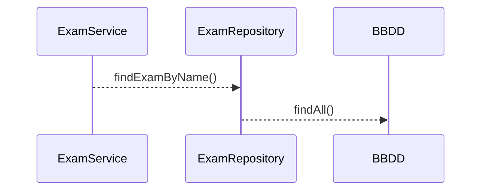

# Kata Junit - Mockito - JaCoCo  sobre Spring Boot
Este repositorio está diseñado para aplicar de manera práctica conceptos de Junit y Mockito mediante un código simple comprendido por un POJO - Service y Repository sobre framework de Spring Boot.
En este documento se describe el paso a paso de la Kata y su aplicación.

## Creación y configuración de proyecto (Kata 1)

### Configuración de dependencias y plugins en el pom

Crear proyecto de tipo Spring Boot con Maven en el IDE de preferencia o utilizado en la organización.
Explicar la configuración de dependencias al modificando el **pom.xml** agregando las dependencias y plugins de:

> **pom.xml  :** 

*Junit*
```xml
    <dependency>
        <groupId>org.junit.jupiter</groupId>
        <artifactId>junit-jupiter</artifactId>
        <version>5.X.X</version>
    </dependency>
```
*Mockito*
```xml
    <dependency>
        <groupId>org.mockito</groupId>
        <artifactId>mockito-core</artifactId>
        <version>X.X.X</version>
    </dependency>
    <dependency>
        <groupId>org.mockito</groupId>
        <artifactId>mockito-junit-jupiter</artifactId>
        <version>X.X.X</version>
    </dependency>
```
*JaCoCo*
```xml
    <plugin>
        <groupId>org.jacoco</groupId>
        <artifactId>jacoco-maven-plugin</artifactId>
        <version>x.x.x</version>
        <executions>
    	    <execution>
    		    <goals>
    			    <goal>prepare-agent</goal>
    		    </goals>
    	    </execution>
	        <execution>
	    	    <id>report</id>
	    	    <phase>prepare-package</phase>
	    	    <goals>
	    		    <goal>report</goal>
	    	    </goals>
	    	    <configuration>
			       <dataFile>${project.basedir}/target/jacoco.exec</dataFile>
					<outputDirectory>${project.basedir}/target/jacoco</outputDirectory>
		        </configuration>
	        </execution>
	      </executions>
	  </plugin>
```
### Componentes del proyecto

### Implementaciones iniciales
> **ExamServiceImpl.java  :** 
```java
    public  class  ExamServiceImpl  implements  ExamService {
	    ExamRepository  examRepository;
	    public  ExamServiceImpl(ExamRepository  examRepository) {
		    this.examRepository = examRepository;
	    }
	    @Override
	    public  Exam  findExamByName(String  name) {
		    Optional<Exam> examOptional = examRepository.findAll()
			    .stream()
			    .filter(e  ->  e.getName().contains(name))
			    .findFirst();
		    Exam  exam = null;
		    if(examOptional.isPresent()){
		    exam = examOptional.orElseThrow(null);
		    }
		    return  exam;
	    }
    }
```
> **ExamRepositoryImpl.java  :** 
```java
    package  com.example.microproyectos.mockitoapp.repositories;
    import  java.util.Collections;
    import  java.util.List;
    import  com.example.microproyectos.mockitoapp.models.Exam;

    public  class  ExamRepositoryImpl  implements  ExamRepository{
	    @Override
	    public  List<Exam> findAll() {
		    return  Collections.emptyList();
	    }
    }
```

## Crear un test utilizando la implementación del repositorio (Kata 2)
Crear un test que permita comprobar el funcionamiento de findExamByName()  utilizando la implementación de ExamRepositoryImpl.java

## Modificar el test creado utilizando Mockito (Kata 3)
Modifica el test que permita comprobar el funcionamiento de findExamByName()  para que no dependa de  la implementación de ExamRepositoryImpl.java

## Refactorizar implementación de ExamService (Kata 4)
+ Devolver en el servicio un Optional< Exam > 
+ Modificamos el test para que verifique  comportamiento
+ Agregamos una nueva prueba que verifique el caso de no encontrar el examen

## Ciclo  de vida del test (Kata 5)
+ Refactorizar la clase test para que el repositorio y el servicio se instancien en un @BeforeEach y dejar el código más limpio
+ Generar un nuevo test para verificar el comportamiento cuando se recibe una respuesta vacía desde el repositorio

## Implementar un nuevo repositorio para obtener preguntas (Kata 6)
Se requiere obtener desde otro origen de datos las preguntas de los exámenes
 + Agregar la interfaz *QuestionRepository*
 + Implementar un método en *ExamService.java* que busque las respuestas por examen
 + Generar un test que  verifique la obtención de preguntas 
 + Generar un test que verifique el comportamiento cuando el examen no tiene preguntas

## Refactorizar tests utilizando Datos de prueba estáticos (Kata 7)
+ Crear una clase que mantenga las constantes de los datos de prueba
+ Refactorizar los test para que tomen la data estática
+ Crear test que valide la obtención de un examen con preguntas cuando la lista de exámenes este vacía

## Verificar invocaciones de métodos simulados (Kata 8)
Mockito permite verificar las invocaciones de los métodos de las clases  monitoreadas
+ Generar un test que permita verificar el llamado del método simulado de *questionRepository.java*
+ Generar un test que permita verificar que no se llame el método simulado de *questionRepository.java*

## Integrar uso de anotaciones  (Kata 9)
+ Definir mocks mediante notación @Mock
+ Integrar dependencia con @injectMocks al la clase concreta
+ Habilitar test mediante MockitoAnnotations.openMocks
+ Usar ExtendsWith como alternativa a MockitoAnnotations

## Guardar exámenes con preguntas  (Kata 10)
Permitir guardar exámenes y sus preguntas
+ Implementar los métodos necesarios para guardar la información tanto de exámenes y preguntas 
+ Crear nuevo test que pruebe el comportamiento del nuevo método  y lo verifique

## Simular autoincremento de Id al guardar  (Kata 11)
para simular un incremento se debe simular el comportamiento que tendría la respuesta del repositorio
+ Modificar test de manera que autoincremente el ID implementando Answer
