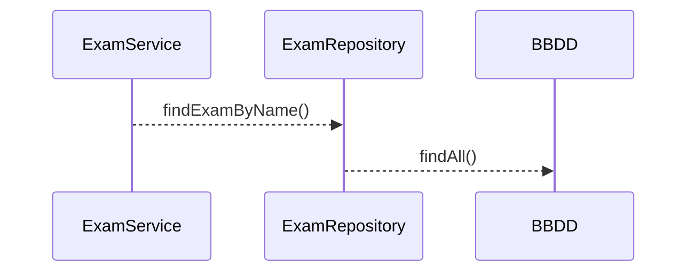

# Kata Junit - Mockito - JaCoCo  sobre Spring Boot
Este repositorio está diseñado para aplicar de manera práctica conceptos de Junit y Mockito mediante un código simple comprendido por un POJO - Service y Repository sobre framework de Spring Boot.
En este documento se describe el paso a paso de la Kata y su aplicación.

## Creación y configuración de proyecto (Kata 1)

### Configuración de dependencias y plugins en el pom

Crear proyecto de tipo Spring Boot con Maven en el IDE de preferencia o utilizado en la organización.
Explicar la configuración de dependencias al modificando el **pom.xml** agregando las dependencias y plugins de:

> **pom.xml  :** 

*Junit*
```xml
    <dependency>
        <groupId>org.junit.jupiter</groupId>
        <artifactId>junit-jupiter</artifactId>
        <version>5.X.X</version>
    </dependency>
```
*Mockito*
```xml
    <dependency>
        <groupId>org.mockito</groupId>
        <artifactId>mockito-core</artifactId>
        <version>X.X.X</version>
    </dependency>
    <dependency>
        <groupId>org.mockito</groupId>
        <artifactId>mockito-junit-jupiter</artifactId>
        <version>X.X.X</version>
    </dependency>
```
*JaCoCo*
```xml
    <plugin>
        <groupId>org.jacoco</groupId>
        <artifactId>jacoco-maven-plugin</artifactId>
        <version>x.x.x</version>
        <executions>
    	    <execution>
    		    <goals>
    			    <goal>prepare-agent</goal>
    		    </goals>
    	    </execution>
	        <execution>
	    	    <id>report</id>
	    	    <phase>prepare-package</phase>
	    	    <goals>
	    		    <goal>report</goal>
	    	    </goals>
	    	    <configuration>
			       <dataFile>${project.basedir}/target/jacoco.exec</dataFile>
					<outputDirectory>${project.basedir}/target/jacoco</outputDirectory>
		        </configuration>
	        </execution>
	      </executions>
	  </plugin>
```
### Componentes del proyecto

### Implementaciones iniciales
> **ExamServiceImpl.java  :** 
```java
    public  class  ExamServiceImpl  implements  ExamService {
	    ExamRepository  examRepository;
	    public  ExamServiceImpl(ExamRepository  examRepository) {
		    this.examRepository = examRepository;
	    }
	    @Override
	    public  Exam  findExamByName(String  name) {
		    Optional<Exam> examOptional = examRepository.findAll()
			    .stream()
			    .filter(e  ->  e.getName().contains(name))
			    .findFirst();
		    Exam  exam = null;
		    if(examOptional.isPresent()){
		    exam = examOptional.orElseThrow(null);
		    }
		    return  exam;
	    }
    }
```
> **ExamRepositoryImpl.java  :** 
```java
    package  com.example.microproyectos.mockitoapp.repositories;
    import  java.util.Collections;
    import  java.util.List;
    import  com.example.microproyectos.mockitoapp.models.Exam;

    public  class  ExamRepositoryImpl  implements  ExamRepository{
	    @Override
	    public  List<Exam> findAll() {
		    return  Collections.emptyList();
	    }
    }
```
## Crear un test utilizando la implementación del repositorio (Kata 2)
Crear un test que permita comprobar el funcionamiento de findExamByName()  utilizando la implementación de ExamRepositoryImpl.java
>test: 
```java
@Test
@DisplayName("should test method service using repository Implement")
void  testKata2_a() {
	ExamRepository  examRepository = new  ExamRepositoryImpl();
	ExamService  examService = new  ExamServiceImpl(examRepository);
	Exam  exam = examService.findExamByName("Matemáticas");
	assertNotNull(exam);
	assertEquals(1L, exam.getId());
}
```
## Modificar el test creado utilizando Mockito (Kata 3)
Modifica el test que permita comprobar el funcionamiento de findExamByName()  para que no dependa de  la implementación de ExamRepositoryImpl.java
> test: 
```java
@Test
@DisplayName("should test method service using Mocks")
void  testKata3() {
	ExamRepository  examRepository = mock(ExamRepository.class);
	ExamService  examService = new  ExamServiceImpl(examRepository);
	List<Exam> exams = Arrays.asList(new  Exam(1L, "Matemáticas"),new  Exam(3L, "Lenguaje"),new  Exam(7L, "Música"));
	when(examRepository.findAll()).thenReturn(exams);
	Exam  exam = examService.findExamByName("Matemáticas");
	assertNotNull(exam);
	assertEquals(1L, exam.getId());
}
```
## Refactorizar implementación de ExamService (Kata 4)
+ Devolvemos en el servicio un Optional< Exam > 
+ Modificamos el test para que verifique  comportamiento
+ Agregamos una nueva prueba que verifique el caso de no encontrar el examen

 > **ExamService.java  :** 
```java 
public  interface  ExamService {
	Optional<Exam> findExamByName(String  name);
}
```
 > **ExamServiceImpl.java  :** 
```java 
@Override
public  Optional<Exam> findExamByName(String  name) {
	return  examRepository.findAll()
				.stream()
				.filter(e  ->  e.getName().contains(name))
				.findFirst();
}
```

tests
>should obtain Math exam when search by name
```java 
@Test
@DisplayName("should obtain Math exam when search by name")
void  testKata4_a() {
	ExamRepository  examRepository = mock(ExamRepository.class);
	ExamService  examService = new  ExamServiceImpl(examRepository);
	List<Exam> exams = Arrays.asList(new  Exam(1L, "Matemáticas"), new  Exam(3L, "Lenguaje"), new  Exam(7L, "Música"));
	when(examRepository.findAll()).thenReturn(exams);
	Optional<Exam> examOptional = examService.findExamByName("Matemáticas");
	assertTrue(examOptional.isPresent());
	assertEquals(1L, examOptional.get().getId());
	assertEquals("Matemáticas", examOptional.get().getName());
}
```
>should don't obtain exam when search by name not in list
```java 
@Test
@DisplayName("should don't obtain exam when search by name not in list")
void  testKata4_b() {
ExamRepository  examRepository = mock(ExamRepository.class);
ExamService  examService = new  ExamServiceImpl(examRepository);
List<Exam> exams = Arrays.asList(new  Exam(1L, "Matemáticas"), new  Exam(3L, "Lenguaje"), new  Exam(7L, "Música"));
when(examRepository.findAll()).thenReturn(exams);
Optional<Exam> examOptional = examService.findExamByName("Deportes");
assertFalse(examOptional.isPresent());
}
```
## Ciclo  de vida del test (Kata 5)
+ Refactorizar la clase test para que el repositorio y el servicio se instancien en un @BeforeEach y dejar el código más limpio
+ Generar un nuevo test para verificar el comportamiento cuando se recibe una respuesta vacía desde el repositorio

>refactorización 
````java
ExamRepository  examRepository;
ExamService  examService;
@BeforeEach
void  setUp() {
	examRepository = mock(ExamRepository.class);
	examService = new  ExamServiceImpl(examRepository);
}
@Test
@DisplayName("should obtain Math exam when search by name")
void  testKata4_a() {
	List<Exam> exams = Arrays.asList(new  Exam(1L, "Matemáticas"), new  Exam(3L, "Lenguaje"), new  Exam(7L, "Música"));
	when(examRepository.findAll()).thenReturn(exams);
	Optional<Exam> examOptional = examService.findExamByName("Matemáticas");
	assertTrue(examOptional.isPresent());
	assertEquals(1L, examOptional.get().getId());
	assertEquals("Matemáticas", examOptional.get().getName());
}
@Test
@DisplayName("should don't obtain exam when search by name not in list")
void  testKata4_b() {
	List<Exam> exams = Arrays.asList(new  Exam(1L, "Matemáticas"), new  Exam(3L, "Lenguaje"), new  Exam(7L, "Música"));
	when(examRepository.findAll()).thenReturn(exams);
	Optional<Exam> examOptional = examService.findExamByName("Deportes");
	assertFalse(examOptional.isPresent());
}
````
 >should don't obtain exam when the list is empty
```java
@Test
@DisplayName("should don't obtain exam when the list is empty")
void  testKata5() {
	when(examRepository.findAll()).thenReturn(Collections.emptyList());
	Optional<Exam> examOptional = examService.findExamByName("Deportes");
	assertFalse(examOptional.isPresent());
}
`````
## Implementar un nuevo repositorio para obtener preguntas (Kata 6)
Se requiere obtener desde otro origen de datos las preguntas de los exámenes
 

